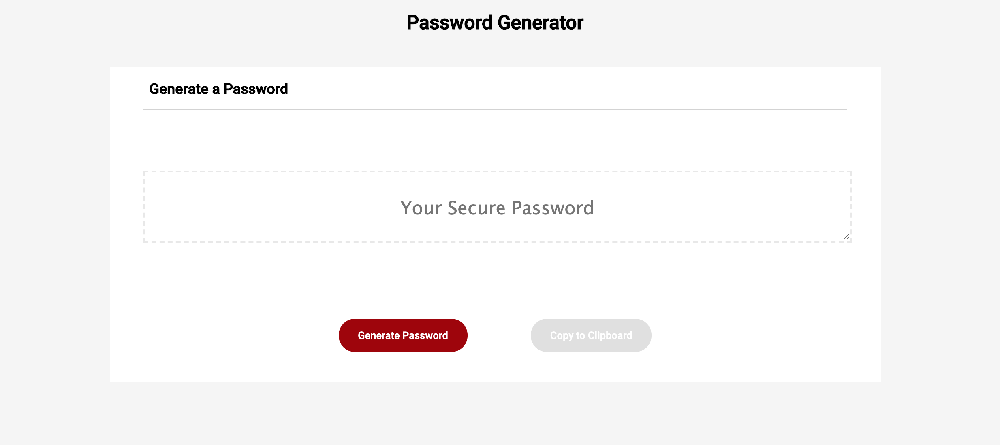

# Password Generator

## Introduction
This Password Generator creates a new personalized strong password. You get to choose if this new password contains numbers,special characters, lower and/or upper case. Not only that but you can choose from 8 to 128 characters.

## Code 
``` js
// Declaring global variables
var specialChar = [ "!","#","$","%","&","()","*","+","-",".","/",":",";","<","=",">","?","@"];
var lowerChar = ["a", "b", "c", "d", "e", "f", "g", "h", "i", "j", "k", "l", "m", "n", "o", "p", "q", "r", "s", "t", "u", "v", "w", "x", "y", "z"];
var upperChar = ["A", "B", "C", "D", "E", "F", "G", "H", "I", "J", "K", "L", "M", "N", "O", "P", "Q", "R", "S", "T", "U", "V", "W", "X", "Y", "Z",];
var numberChar = ["0","1","2","3","4","5","6","7","8","9"];
// Password is empty 
var password = [];
// PasswordFlat every selection into one array
var passwordFlat = [];
// newPassword is the creating of the password depending on the numChar that user wrote
var newPassword = [];
```

``` js
// For loop to generate the random password 
for (var i = 0; i < numChar; i++) {
// Randomly chooses password and push it to newPassword
console.log(Math.floor(Math.random() * passwordFlat.length));
```
``` js
// Fuction that copies password to clipboard
function copyToClipboard() {
    var copyText = document.getElementById("password");
    copyText.select();
    document.execCommand("copy");
    // Alerts what you just copied 
    alert(copyText.value + " copied to clipboard")
}
```
## Technologies
* HTML
* CSS
* JS

## Instalation
1. On GitHub, navigate to the main page of the repository.
2. Under the repository name, click Clone or download.
3. To clone the repository, click "Clone with HTTPS".
4. Open Terminal.
5. Change the current working directory to the location where you want the cloned directory to be made.
6. Type git clone, and then paste the URL you copied in Step 2.
7. Press Enter. Your local clone will be created.

## Authors
* Lilliana Ramos

